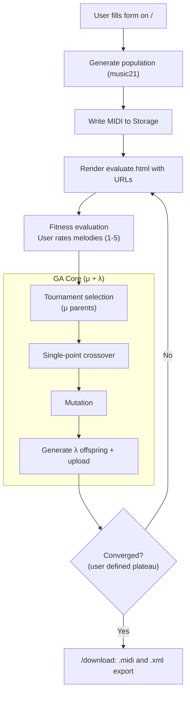

# 🎵 Melodyos - Genetic Melody Generator

<p align="center">
    <picture>
        <source media="(prefers-color-scheme: light)" srcset="https://raw.githubusercontent.com/frederikoadr/melodyos/refs/heads/main/static/img/applogo.png">
        
    </picture>
</p>

<p align="center">
  <a href="https://melodyos.vercel.app">
    
  </a>
</p>

An interactive melody generator driven by a genetic algorithm. Users rate AI-generated phrases to 'evolve' preferred musical ideas, which can then be exported as MIDI or MusicXML for seamless integration into any creative workflow.

## Features

- Generate an initial population of melodies (music21) in a chosen key/scale.
- User evaluation per generation; ratings drive selection, crossover, and mutation.
- MIDI and MusicXML export for further melody exploration.

## Architecture

- Flask app (`app.py`) with routes:
  - `/` (start): collect inputs; generate population; publish MIDI URLs.
  - `/evaluate`: accept ratings; select, crossover, mutate; create next-gen MIDI.
  - `/download`: export MusicXML; create fitness plot; publish downloadable links.
- Genetic operators (`musicgen.py`): chromosome creation, crossover, mutation, and file exports.
- Storage: Object storage for MIDI and figures; NoSQL JSON database for users.
- Sessions: Redis-backed Flask sessions.

## Flow Diagram



## Requirements

- Python 3.10+
- Redis (local or remote via `REDIS_URL`)
- Appwrite project (endpoint, project ID, API key)
- Firebase Realtime Database (service account + DB URL)
- Optional: LilyPond for PDF export (set path via env)

## Environment Variables (.env)

```
SECRET_KEY=your-secret
REDIS_URL=redis://localhost:6379/0

APPWRITE_ENDPOINT=https://cloud.appwrite.io/v1
APPWRITE_PROJECT_ID=your-project-id
APPWRITE_API_KEY=your-api-key

FIREBASE_DATABASE_URL=https://your-db.firebaseio.com
# Either one of:
FIREBASE_SERVICE_ACCOUNT_JSON={"type":"service_account", ...}
# or
GOOGLE_APPLICATION_CREDENTIALS=/absolute/path/to/serviceAccount.json

LILYPOND_PATH=/usr/bin/lilypond   # or Windows path
```

## Setup

```bash
python -m venv .venv
source .venv/bin/activate  # Windows: .venv\Scripts\activate
pip install -r requirements.txt
```

## Run (Flask)

```bash
# Optionally start local Redis
redis-server

# Ensure .env is configured
python app.py
# or
FLASK_APP=app.py FLASK_ENV=development flask run
```

Navigate to:
- User flow: http://localhost:5000/

## How It Works

1. Initial population: `create_chromosome` builds short melodies in selected scale/key.
2. Export: `create_midi` writes to Storage Bucket.
3. Evaluation: users rate each melody; ratings are summed per generation.
4. Selection & variation: `tournament_selection` → `single_point_crossover` → `mutation`.
5. Next generation: new MIDI files are created and published for rating.
6. Download: `create_multi_xml` exports MusicXML; a fitness plot is generated via matplotlib and uploaded.

### Genetic Notation

- **Population size:** The app currently uses a fixed population size of 4 per generation.
- **Parents (μ):** Tournament selection chooses μ parents (effectively the whole population by pairwise competitions). In each iteration two candidates are sampled and the higher-rated one wins.
- **Offspring (λ):** Single-point crossover is applied pairwise to parents, producing λ offspring such that $\lambda = \mu$ (population size is preserved each generation).
- **Normalized fitness:** For a generation with total rating sum `fit`, percentage fitness is  
  $$fit_{\%} = \frac{fit}{(population\_num \cdot 5)} \times 100$$
- **Mutation intensity:** For a melody of length $n$ notes, mutation attempts per melody are $k = \lfloor n/4 \rfloor$ with per-attempt probability $p = 0.5$.
  - Expected mutated notes per melody: $\mathbb{E}[M] = k \cdot p$.
  - Probability of at least one mutation: $\mathbb{P}(M \ge 1) = 1 - (1-p)^k$.
  - With the default $n=8$: $k=2$, $\mathbb{E}[M]=1$, and $\mathbb{P}(M \ge 1)=0.75$.
- **Cadence preservation:** The last note is not mutated (mutation index is drawn from $[0, n-2]$) to keep a stable ending tone.

## Troubleshooting

- If matplotlib/NumPy fails to import in your environment, the app will skip plotting gracefully.
- If Firebase isn’t initialized, the app logs a warning and continues without DB writes.
- Ensure `REDIS_URL` is reachable for server-side sessions.

## Notes

- `evaluate` uses a fixed `population_size=4`. Persist the initial value if you want variable population sizes.